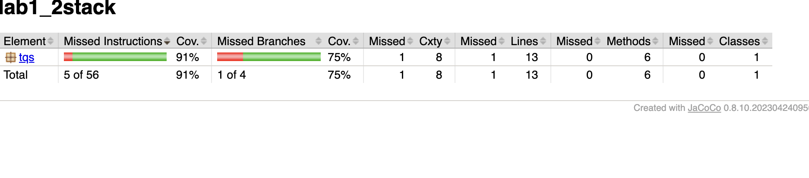
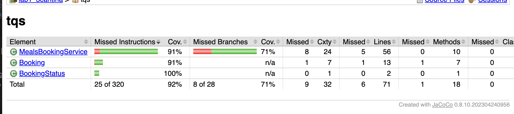

## 1.2 Simple Stack unit
### 1_2 F 
when i disable some tests this is the result 


### 1_2 J 
A scenario could be when the popTopN method is called with a very large value of n on a stack with millions of elements, potentially causing memory issues that wasn't detected in our tests. Code coverage is useful to ensure all methods and branches are executed during testing, however, it only measures the quantity of code tested, not the quality of the tests themselves.

## 1.3 Meals Booking Service 

### Basic Rules:
- Only one booking per student allowed per service shift (no double booking)
- Tickets that have been used (to check-in) cannot be used again
- There's a maximum service capacity per shift (lunch, dinner, etc.)
- Canceled tickets can't be used

### Additional Business Rules:
1. **Booking window restriction**: Students can only book meals within a specific time window (e.g., 2 hours before service starts)
2. **Cancellation deadline**: Students can only cancel bookings up to a certain time before service (e.g., 30 minutes)
3. **Special dietary requirements**: System should handle special meal requests (vegetarian, gluten-free, etc.)

### JaCoCo Coverage Analysis



The coverage is decent at 92% instruction coverage, but the 71% branch coverage shows we missed testing some important decision paths. This is exactly what happens when you don't write comprehensive tests - you get blind spots in your code that could hide bugs.

**Missing branches that hurt our coverage:**

1. **Empty/null service shift validation** - We never test what happens when `serviceShift` is null or empty in the `bookMeal` method
2. **Capacity edge case for zero** - The `setShiftCapacity` method checks if capacity <= 0, but we only test positive values
3. **Cancel booking on non-ACTIVE status** - We test canceling ACTIVE bookings, but never try to cancel USED or CANCELLED ones
4. **GetAvailableCapacity with unknown shift** - This method uses `getOrDefault`, but we never test what happens with a completely unknown shift

These missing test scenarios represent real-world edge cases that could cause production bugs. The 71% branch coverage is a red flag - it means almost 30% of our decision logic is untested. High instruction coverage can be misleading because it counts every line executed, but branch coverage shows whether we're testing all the "what if" scenarios in our conditional logic.

**Why this matters:** Imagine a student tries to book with an empty string as service shift - our app would crash with a validation error we never tested. Or what if someone tries to cancel an already-used ticket? We assume it returns false, but we never verified this behavior in our tests.

### JaCoCo Coverage Rules Implementation

Added a JaCoCo rule in `pom.xml` to enforce minimum 90% line coverage for all classes (excluding test classes and utility classes like `Main`):

```xml
<execution>
    <id>check</id>
    <phase>verify</phase>
    <goals>
        <goal>check</goal>
    </goals>
    <configuration>
        <rules>
            <rule>
                <element>CLASS</element>
                <excludes>
                    <exclude>*Test</exclude>
                    <exclude>*Tests</exclude>
                    <exclude>**/*Test*</exclude>
                    <exclude>ua.Main</exclude>
                </excludes>
                <limits>
                    <limit>
                        <counter>LINE</counter>
                        <value>COVEREDRATIO</value>
                        <minimum>0.90</minimum>
                    </limit>
                </limits>
            </rule>
        </rules>
    </configuration>
</execution>
```

**Solution approach:**
- Initially failed because `ua.Main` class had 0% coverage (simple "Hello World" utility class)
- Applied the simplest solution: excluded utility/data-centric classes with no business logic from coverage analysis
- Build now passes with `mvn clean test verify` - the JaCoCo check validates that business logic classes meet the 90% line coverage requirement

This demonstrates a realistic approach to coverage rules - excluding classes that don't contain testable business logic (like main classes, DTOs, simple utilities) while enforcing strict coverage on classes that matter for application behavior.


